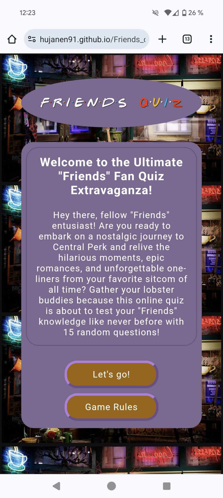

# Friends Quiz - A JavaScript with HTML & CSS Project for Code Institute

## General information
---

This is a quiz with questions to test the users knowledge on the tv series Friends.
The website can be found here: [Friends Quiz](https://hujanen91.github.io/Friends_quiz_project_2/)

The purpose of this website is to promote myself and my skills in Html, CSS & JavaScript. The website is a simple quiz focused on testing how much the user knows about the tv series Friends.

The game is built in one HTML file where each section within this file that needs to be hidden or not have the class of "hide". This is decided through JavaScript with eventlisteners depending on what the user click on. 

Mockup:

## Project Goals
- Create a website that showcases my skills in HTML, CSS and JavaScript.
- Create a website that is responsive on all devices.
- Create a website that is easy to understand.
- Create a website that shows the rules for the game.
- Create a website that contains a game for the user to interact with.
- Create a game that shows no errors.
- Create a game with multiple choices for the user to choose between.
- Create a game that displays the users score.
- Create a game that displays custom messages depending on the score.
---

## Colors
- Root Colors:
    - Background color of main container: #7e6892
    - Border and answer button colors: #5d4079
    - Button color: #9b6500
    - Background color if background image does not load: #ffe8bd

- Correct answer button color = #488d48 Green
- Correct answer text color = #ffffff White
- Wrong answer background color = #753333 Red
- Wrong answer text color = #ffffff White 
- Text Color = #ffffff White
--- 

## Typography
- Font
    - The main font used in the project is Arial.
    - The fallback font is sans-serif. 
---

## Wireframes (Balsamiq)
I created the wireframes for this site with Balsamiq. All wireframes can be found in the folder called [Wireframes](https://github.com/gStarhigh/pro2/tree/main/documentation/wireframes).
The wireframes should not be considered finished product, but as a tool I used as inspiration when creating the Quiz.

<b>Wireframes for desktop</b>

Index

Questions

<b>Wireframes for tablet</b>

Index

Questions

<b>Wireframes for mobile device</b>

Index

Questions

---

## General features
- The website was created with the idea of making a quiz game to test the users knowledge of the tv series Friends.
- The game provides 15 questions that is randomly picked from an array of 50 questions in total.
- The game keeps track of the questions that has been asked so it wont give the user the same question twice.
- The answer buttons are disabled as soon as the user clicks on one of the answers so that the user can't change their mind and click multiple times on different answers.
- If the user answered correctly, the score is increased in the bottom left container and the buttons will turn red and green to display if the user picked the right or wrong answer.
- When either the user has chosen an answer the next question button will appear that will load the next question for the user when clicked, resets the answer buttons and lets the user answer the next question.
- The website is responsive on all devices.

### Home Section
- When you enter the site you are greeted with the main content of the website. 
A clear header that shows the user what the website is all about and some text to tell you about the game itself.
- If the user clicks on the Rules button a modal window will pop up to give the user a funny description of the rules. Clicking anywhere outside the window will close it. The code for this modal was found here: https://www.w3schools.com/howto/howto_css_modals.asp
- When the user clicks on "Let's go!" the game will start. The content of the main page will be hidden with "hide" classes and the questions, answers, score counter and the next button will be collected with eventListeners and hidden objects will have class "hide" removed to be visible for the user.

<b>Screenshot of Home page</b>

### Rules Section
- The rules are displayed in a modal window when clicking on Game Rules. 
- The rules window will tell the user that there are no rules, in a funny way hinting to the series and their main characters.
- Clicking on the X or anywhere outside of the modal window will make the window close itself. 

<b>Screenshot of Rules page</b>

### Game Section
- Clicking on "Let's go!" on the starting page will start the game. It will hide the description, rules button and let's go button for the user and instead display the first question, 4 buttons with possible answers and below the answers a score window and a "back to start" button has now been disabled from "hide" to show in the new window. 
- When the user clicks on one of the answers the button will turn either green or red. 
-If the answer is correct the clicked button will turn green and the other 3 buttons will turn red to clearly show that the other answers where incorrect.
- If the answer is incorrect the clicked button and the other 2 buttons with incorrect answers will turn red and the correct answer will turn green to clearly show the user wich one of the answers was correct.
- When all the 15 questions has been answered the user will be directed to the finished section.

<b>Screenshot of Questions page</b>

<b>Screenshot of answers being clicked</b>

### Finished Section
- When the user arrives at the last page after answering 15 questions the total score vs total number of questions will be displayed.
- Depending on the score that the user got, different messages are displayed telling the user how great of a job they did. 
- Below that is the score shown for the user,""x" out of 15".
- Below that is the "Back to start" button that will send the user back to start giving them the opportunity to play again.

<b>Screenshot of Finished page with 14 out of 15 correct answers</b>

### 404 page
- If the user types in the wrong adress the 404 page will display to tell the user that the page doesn't exist.

<b>Screenshot of 404 page</b>

--- 

## Testing
### Icons, Questions, Answers and Buttons:
#### Buttons:
- All the buttons are working and will take you to the correct page.
- All buttons do what they are supposed to do by the users interaction.
### Game logic:
- All questions displays randomly each time.
- The score increments by 1 if the user has clicked the correct answer.
- The score does not increment if the user has clicked the wrong answer. 
- The buttons gets disabled when the user has clicked an answer.
- The buttons gets enabled when the user clicks the next question button.
- The correct message gets displayed when the game is finished according to the amount of correct answers the user got. 
- The Back to start button resets the questions and the score and takes the user back to the start page where they can choose to play again. 
--- 
## Code validation
- All code on the site has been validated, HTML,CSS & JavaScript, by use of the W3C validator and Jshint. 
### HTML
- W3C - HTML validator: (https://validator.w3.org/)
    - W3C Validator for HTML shows no errors or warnings on the index.html file.
    - The W3C validator for HTML did give 2 errors before I corrected them. A stray div was found and an a linking to them index.html to reset the game was coded inside a button wich wasnt allowed. I removed the div and I removed the a attribute and created a small function in javascript to reset my quiz and send the user to the first page as soon as they pressed the "Back to start" button no matter where in the quiz they are.

<b>Image of the HTML validation error</b>

<b>Image of the HTML validation after fixing the errors</b>

### CSS
- W3C - CSS Validator: (https://jigsaw.w3.org/css-validator/)
    - W3C Validator for CSS shows no errors or warnings in the style.css file.

<b>Image of the CSS validation</b>

### JavaScript
- Jshint: (https://jshint.com/)
    - Jshint validator shows no errors in any Javascript file.
- Questions.js:
    - The Jshint validator shows when questions.js are tested that there are 2 undefined variables. This refers to the Lines 14 and 473 in the questions.js file. These variables are defined in another js file, the script.js. This is why this information is presented by jshint.com.

<b>Image of Jshint validation of the questions.js file</b>

- Script.js:
    -  The Jshint validator shows when script.js are tested that there are 2 undefined variables. This refers to the lines: 54, 55, 84, 85 and 87 in the script.js file. These variables are defined in another js file, the question.js. This is why this information is presented by jshint.com. The variables can be found on lines 1, 83 and 165 in the question.js file.

<b>Image of Jshint validation of the script.js file</b>

---

## Testing on different browsers
- The website is tested on different devices. The website is responsive on all tested devices. 
- The website is tested on different browsers. The website is working on all tested browsers.
- Tested browsers: 
    - Google Chrome
    - Firefox
    - Safari
    - Microsoft Edge

## Device testing on different devices
- The site has been tested through Chrome Dev tools for responsivness. The site is responsive on all sizes.
- Simulation test with devices: (the site is responsive and works on all simulated devices)
    - iPhone 12 Pro
    - iPad Air (Rotate)
    - iPad Mini (Rotate)
    - Galaxy fold
    - Samsung Galaxy S21 Ultra
    - Samsung Galaxy Z fold
- Tested on real devices:
    - Apple ipad air
    - Laptop
    - PC
    - Google pixel 8 pro

## Testing tools used
- I have tested the site in Chrome Dev tools. 
- I have tested the site using Lighthouse in Chrome Dev Tools, for both Mobile and Desktop with a 100 in score on everything on both mobile and desktop. Results can be found below on the mobile testing:

<b>Lighthouse report:</b>

---

## Testing
1. Start

| **Feature** | **Action** | **Expected result** | **Actual Result** |
|-------------|------------|---------------------|-------------------|
| Startpage | Click on "Let's go | Start the game and display the first question and answers| The game started and showed me the first question and answers |
| Startpage | Click on "Let's go | The game should hide the "Let's go" and "Rules" button and remove hide on "Score" and "Back to start" to display those buttons  | "Let's go" and "Rules" button was hidden and hide was removed so I could see the "Score" and "Back to start" button  |

2. Rules Modal

| **Feature** | **Action** | **Expected result** | **Actual Result** |
|-------------|------------|---------------------|-------------------|
| Rules Modal | Click on "Rules" | A modal pop-up window should display on top of the games description so the user can read the rules | The modal pop-up window shows up after clicking Rules. |
| Rules Modal | Click on X or outside of the Rules modal| The modal pop-up window should close if the user clickes on X or anywhere outside of the modal window | The Rules modal closed when clicking X or outside the modal |

3. Start game

| **Feature** | **Action** | **Expected result** | **Actual Result** |
|-------------|------------|---------------------|-------------------|
| Start Game | Click on "Let's go | Hide "Rules" and "Let's go" button and display the answers, "score" and "Back to start" button and display first question | Displayed the first question and the answers buttons, hid "Let's go" and "Rules" and displayed "Score" and "Back to start button |

4. Game section

| **Feature** | **Action** | **Expected result** | **Actual Result** |
|-------------|------------|---------------------|-------------------|
| Game Section | Click the wrong answer | The answer buttons should change color to red on the wrong answers and green on the correct answer to show the user what answer was correct | The answer buttons changed color and turned red on the wrong answers and green on the correct answer|
| Game Section | Click the wrong answer | The answer buttons should be disabled so the user can't click on them no more | The answer buttons are disabled and I can't click on them
| Game Section | Click the wrong answer | The next button should appear | The next button did appear |
| Game Section | Click the wrong answer | The score should NOT increment by 1 | The score did NOT incremented by 1 |
| Game Section | Click the correct answer | The correct answer should turn Green | The correct answer turned Green |
| Game Section | Click the correct answer | The wrong answers should turn Red | The wrong answers turned Red |
| Game Section | Click the correct answer | The score should increment by 1 | The score incremented by 1 |

5. Finished Section

| **Feature** | **Action** | **Expected result** | **Actual Result** |
|-------------|------------|---------------------|-------------------|
| Finished Section | Finished the game | The users score should appear | The users score did appear |
| Finished Section | Finished the game | If the user got 0-9 correct answer a custom message should appear | The custom message did appear |
| Finished Section | Finished the game | If the user got 10-14 correct answer a custom message should appear | The custom message did appear |
| Finished Section | Finished the game | If the user got 15 correct answer a custom message should appear | The custom message did appear |
| Finished Section | Click the "Back to start" button | The quiz should reset and the startpage should appear | The quiz did reset and the startpage did appear |

---

## Possible future implementations
- A username
- More questions
- A lightning-round where the user should match quotes with the right character
- A timer in the lightning-round
- Images from the show related to the question that will display when answering the right questions
- Images for each custom message when finished score is displayed

---

## Bugs and fixes
- Had a bug where the score would increment by 2, 6 or 8 when answering a question.
It would also increment even if the user clicked the wrong answer.
This was solved when I moved the eventListener for the score to sit on it's own above the "startGame" function
- The quiz did not collect the answers for the buttons on a new question.
This was solved by adding "++" on "[currentQuestionIndex++]" in the setNextQuestion function on line 76.
- The "Back to start" button was not coded in the script.js but in the index.html as an anchor element and was giving me errors in the validator. 
I solved this by adding in a eventListener on the "backButton" in script.js (line 32) to reload the quiz and reset it so the user is sent back to the startpage.
---

## Final Result

### Below is captured screenshots of the website on Desktop:

Screenshot of Start page

Screenshot of Rules modal

Screenshot of questions and answers page

Screenshot of when answer has been picked

Screenshot of Finished page with 0-9 correct answers

Screenshot of Finished page with 10-14 correct answers

Screenshot of Finished page with 15 correct answers

### Below is captured screenshots of the website on a phone sized screen:

Screenshot of Start page

Screenshot of Rules modal

Screenshot of questions and answers page

Screenshot of when answer has been picked

Screenshot of Finished page with 0-9 correct answers

Screenshot of Finished page with 10-14 correct answers

Screenshot of Finished page with 15 correct answers

---
## Deployment
- This website was developed using Gitpod which I used to commit and push to GitHub using the terminal in GitPod. 
### Here are the steps to deploy this website to GitHub Pages from its GitHub repository:
- Log in to GitHub and locate the GitHub Repository.
- At the top of the Repository, locate the Settings button on the menu.
- Under Source, click the dropdown called None and select Main Branch.
- The page will refresh automatically and generate a link to your website.
---

## Credits

### Code:
- I followed Web Dev Simplified video on how to create a quiz in javascript to get me started and then I modified it to work with my code and my quiz. Inspired codes in script.js is marked down above the code. 
    - Link to video (https://www.youtube.com/watch?app=desktop&v=riDzcEQbX6k)

- The modal for the game rules is from W3Schools
    - Link (https://www.w3schools.com/howto/howto_css_modals.asp)

- The rest of the codes in script.js is created by me with help and inspiration from a lot of googling, reading in different forums and looking around at other peoples codes and picking out what I think would work, use it as inspiration and modifying snippets to make it work with my code.-

### Images:
- The  background images is from: https://wallpaperaccess.com/
    - Link: (https://wallpaperaccess.com/central-perk)
    - Images from wallpaperacces is okay for non-commercial use:
    (https://wallpaperaccess.com/faq#personaluse)

### Title Icon:
- Icon credit, Favicon.
    - Link: (https://icons8.com/icon/4qlkCQverrIB/friends-tv-series ) 

### Readme.md file:
- I got help with the readme file from CodeInstitutes samplereadme.
    - Link : (https://github.com/code-institute-solutions/samplereadme)